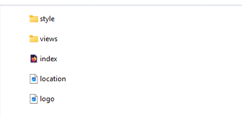
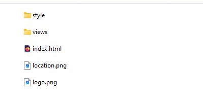
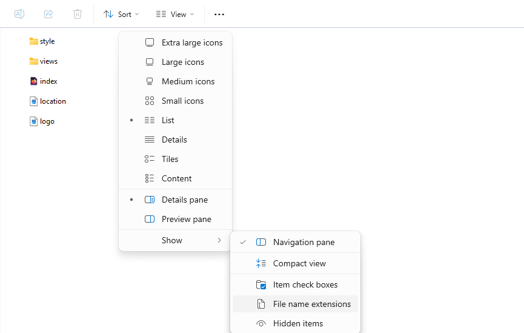
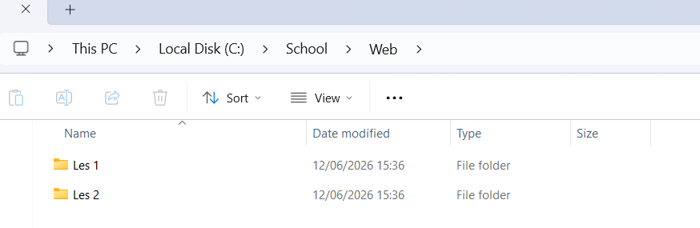
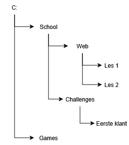
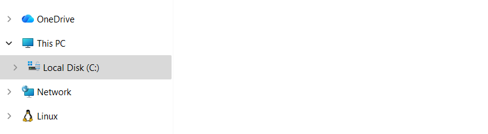
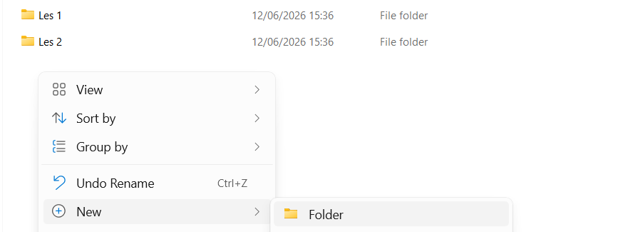
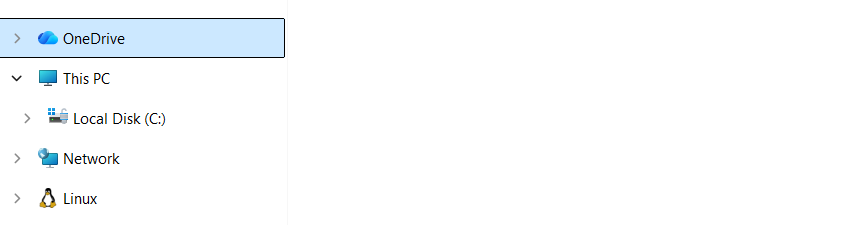

## Waar gaat deze week over?

Je gaat de komende jaren met heel veel bestanden werken: terwijl je aan het coderen bent, maar ook gewoon voor je schoolwerk. Een duidelijke **mappenstructuur** helpt je om gemaakt werk niet kwijt te raken en maakt het makkelijker om back-ups te maken.

Voor de lessen van de volgende weken is het belangrijk dat je vlot met bestanden en folders kunt werken. Daarom starten we daarmee.

<x-callout>

**Aan het einde van deze week** weet je wat bestanden en bestandsextensies zijn, wat folders zijn, heb je een eigen mappenstructuur voor je schoolwerk gemaakt, en weet je hoe je OneDrive gebruikt om je werk veilig te bewaren.

</x-callout>

## 1.1 Bestanden

Een bestand is 'iets' op je laptop, computer of MacBook. Voorbeelden zijn een Word-document, een game-*executable* waarmee je een spel start, of een foto.

Als jij straks als software developer websites maakt, werk je ook met bestanden. Een website bestaat namelijk uit verschillende soorten bestanden die naar elkaar verwijzen.

## 1.2 Bestandsextensies

Elk bestand heeft een **extensie**. Dankzij die extensie begrijpen apparaten wat voor soort bestand iets is. De extensie staat achter de punt in de bestandsnaam, bijvoorbeeld `index.html` of `logo.png`.

Een paar veelvoorkomende extensies:

| Extensie | Wat betekent dit |
| --- | --- |
| `.exe` | Een uitvoerbaar programma (bijvoorbeeld om een spel of app te starten). |
| `.docx` | Een Word-document. |
| `.html` | Een webpagina. |
| `.css` | De opmaak (stijl) van een webpagina. |
| `.png` / `.jpg` | Een afbeelding. |

## 1.3 Bestandsextensies tonen

Standaard verbergt Windows de extensies. Voor software developers is het juist handig om ze te zien — dan weet je precies wat voor soort bestand iets is.

Open je **File Explorer** en zet onder de tab **View** de optie **File name extensions** aan.

## 1.4 Mappen en een mappenstructuur

Op je laptop werk je met verschillende **mappen** (ook wel *folders* genoemd) waarin je bestanden zet. Je kunt ook mappen aanmaken binnen andere mappen. Die opbouw noemen we een **mappenstructuur**.

Terwijl je software ontwikkelt is het belangrijk dat je weet op welke plaats bestanden opgeslagen worden, en in welke folder dat gebeurt.

## 1.5 Nieuwe mappen maken

Maak een nieuwe folder aan op je `C:`- of `D:`-schijf. Selecteer eerst de schijf in je File Explorer.

Klik daarna met de **rechtermuisknop** in de File Explorer om een nieuwe folder aan te maken.

## 1.6 OneDrive

Op Windows-laptops heb je toegang tot **OneDrive**. OneDrive is een plaats om bestanden en folders op het internet op te slaan.

We raden je op school aan om OneDrive te gebruiken, zodat je gemaakte bestanden nooit kwijtraken — ook niet als je laptop kapotgaat. Je bestanden staan dan namelijk nog steeds op het internet.

Je kunt je OneDrive selecteren door deze aan te klikken in je File Explorer. Let op dat je ingelogd moet zijn met een Microsoft-account.

## 1.7 Folders en bestanden tijdens je schooltijd

Terwijl je de opleiding software developer volgt, gaan je docenten ervan uit dat je bestanden zoals Word-documenten op je OneDrive opslaat, zodat je ze niet kwijtraakt.

<x-callout type="warning">

**Let op:** voor **code** geldt het tegenovergestelde. Code sla je juist *niet* op via OneDrive — sommige applicaties werken dan namelijk niet goed. Voor het opslaan van code gebruiken we als developers een techniek die **Git** heet. Daarover leer je vanaf week 2 meer.

</x-callout>

## 1.8 Onthoud voor nu het volgende

<x-card title="De twee vuistregels van deze week">

- Sla **code** niet op via OneDrive.
- Sla **andere bestanden** (zoals documenten) juist wél op via OneDrive.

</x-card>

Volgende week leer je hoe je je code op de juiste manier opslaat met Git.

<x-nav label="Klaar met de theorie?">
[Oefeningen](/pages/week1-oefeningen.html)
[Meetmoment](/pages/week1-meetmoment.html)
[Inleveropdracht](/pages/week1-inleveropdracht.html)
</x-nav>
