## Waar gaat deze week over?

In week 1 heb je geleerd wat bestanden zijn en hoe je ze opslaat. Wat je nog niet weet, is hoe wij als developers de verschillende **versies** van onze code bijhouden en bewaren. Dat ga je nu leren.

<x-callout>

**Aan het einde van deze week** weet je wat Git en GitHub zijn, weet je wat een repository en een fork zijn, en heb je voor het eerst code van het internet naar je eigen laptop gekopieerd (*clonen*).

</x-callout>

## 2.1 Over Git

Software developers gebruiken meestal een techniek met de naam **Git** om de verschillende versies van hun code te beheren.

Met Git kun je je code opslaan en aanpassen, maar je kunt ook **terugkijken** naar vorige versies en precies bijhouden wanneer welke wijziging is gemaakt. Dat is voor developers erg nuttig.

Eerlijk is eerlijk: Git is niet de makkelijkste techniek om mee te starten. Daarom begin je er meteen aan het begin van je opleiding mee, zodat je het de rest van je studie kunt gebruiken.

## 2.2 Git installeren

Voordat je Git kunt gebruiken, moet je het installeren op je laptop.

Ga naar [git-scm.com/install/windows](https://git-scm.com/install/windows) en download de nieuwste versie van Git.

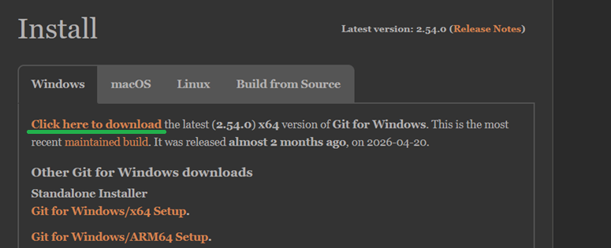

Nadat je de gedownloade *executable* uitvoert, zie je het installatiescherm. Klik op installeren en sluit de installer niet voordat deze klaar is.

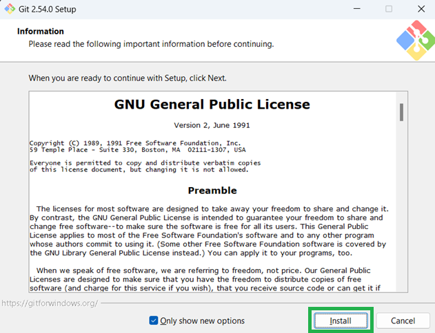

## 2.3 Een GitHub-account maken

Je hebt nu Git geïnstalleerd. Daarmee kan je laptop code online zetten en beheren. Maar je hebt ook een plaats nodig om die code écht op te slaan. Daarvoor gebruiken wij **GitHub**.

> Er bestaan ook andere plaatsen om code op te slaan met Git, maar GitHub is degene die wij gebruiken.

Ga naar [github.com](https://github.com/) en maak een eigen account. Let daarbij op het volgende:

<x-compare>
<x-compare-item title="Privé e-mailadres">

Je account blijft **altijd** toegankelijk. Een goede optie als je van plan bent zelf projecten te starten die je wilt bewaren.

</x-compare-item>
<x-compare-item title="Schoolmail">

Je schoolmail wordt een tijd na je afstuderen verwijderd, waardoor je account ontoegankelijk kan worden. Handig als je school en privé gescheiden wilt houden.

</x-compare-item>
</x-compare>

<x-callout type="warning">

**Onthoud goed:** je gebruikersnaam, wachtwoord én het gebruikte e-mailadres. Je hebt deze de rest van je opleiding nog nodig. Je gebruikersnaam kun je later wijzigen, je gekozen e-mailadres niet.

</x-callout>

Na het aanmaken krijg je een validatie-e-mail. Klik op de link daarin om je account te activeren.

## 2.4 Repositories

Alle code op GitHub wordt opgeslagen in een **repository**. Vertaal je 'repository' naar het Nederlands, dan krijg je het woord *opslagplaats*. En dat is precies wat het is: een opslagplaats voor code!

## 2.5 Forks van repositories

Voordat je zelf een repository maakt, laten we je eerst ervaren waarom repositories nuttig zijn. Zorg dat je ingelogd bent op GitHub en ga naar deze repository:
[github.com/curio-lesmateriaal/Professionaliseren_M1_Eerste_repository](https://github.com/curio-lesmateriaal/Professionaliseren_M1_Eerste_repository)

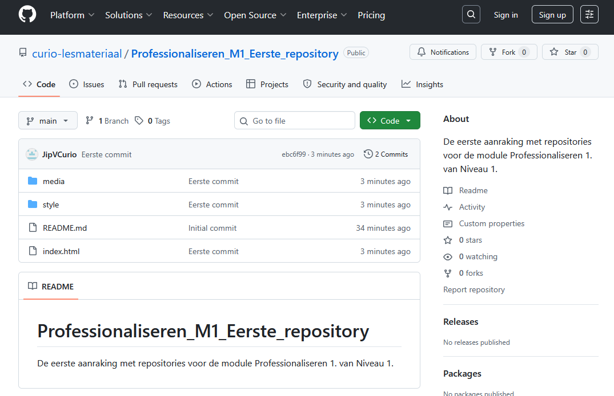

Je gaat zo een **fork** van deze repository maken. Een fork maken betekent dat je een **eigen kopie** van een repository maakt waar je zelf op door kunt werken — zonder dat je de originele repository verandert.

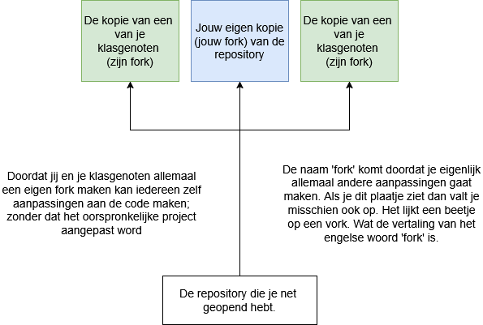

## 2.6 Een bestaande repository forken

Nu je weet wat een fork is, ga je er zelf één maken van de voorbeeldrepository. Zorg dat de repository openstaat in je browser en klik op de **Fork**-knop.

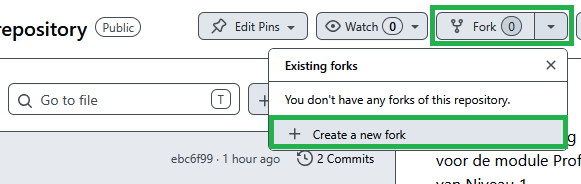

Geef je repository de naam **mijn eerste fork**. Je ziet dat de naam automatisch `mijn-eerste-fork` wordt, met jouw gebruikersnaam ervoor. Dit is namelijk jouw eigen kopie.

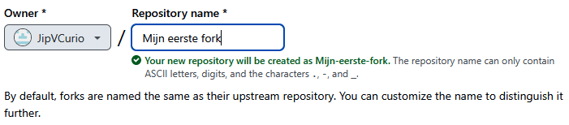

Klik daarna op **Create fork**. Er wordt nu een kopie gemaakt en aan jouw GitHub-account gekoppeld. Daarna word je doorgestuurd naar je eigen kopie — dat zie je linksbovenin je scherm.

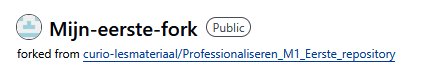

Je weet nu hoe je een kopie maakt van een bestaande repository.

## 2.7 Een Git-tool kiezen

Je hebt een fork gemaakt op GitHub. In de volgende stap leer je hoe je die code naar je eigen laptop kopieert. Daarvoor heb je een **programma** nodig.

Vroeger deden we dit via de command prompt (dat kan nog steeds!), maar dan moet je veel commando's onthouden. Daarom raden we je aan een hulpmiddel te kiezen. Een paar voorbeelden:

<x-card title="GitHub Desktop">

De tool die door GitHub zelf is gemaakt. Goed startpunt voor beginners.
[desktop.github.com/download](https://desktop.github.com/download/)

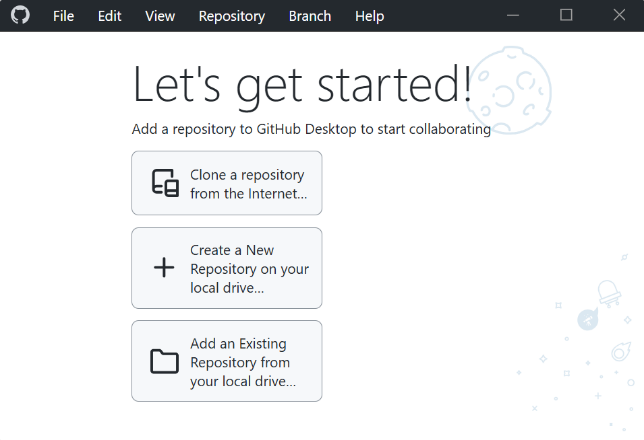

</x-card>

<x-card title="GitKraken">

Wordt gebruikt door een aantal grote bedrijven. Let op: de gratis versie werkt alleen met *publieke* repositories.
[gitkraken.com/git-client](https://www.gitkraken.com/git-client)

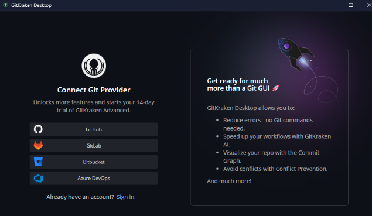

</x-card>

Meer voorbeelden vind je op [git-scm.com/tools/guis](https://git-scm.com/tools/guis). Kies en installeer in elk geval één tool waarmee jij met Git gaat werken. Je mag later altijd nog wisselen naar een tool die je fijner vindt.

<x-callout>

De meeste Git-tools zijn gratis, maar niet allemaal. Sommige hebben betaalde functies — maar alles wat je tijdens je studie nodig hebt, kun je gratis blijven doen.

</x-callout>

## 2.8 Het clonen van een repository

Je hebt nu een tool gekozen. Met een fork heb je een eigen kopie van een online repository. Om er ook echt wijzigingen aan te maken, moet je de code eerst naar je laptop kopiëren. Dat kopiëren noemen we **clonen**.

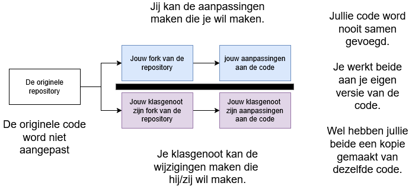

## 2.9 Je repository clonen naar je laptop

Zoek in je gekozen tool naar de optie om een repository te **clonen**. Mogelijk moet je eerst inloggen met je GitHub-gegevens. Om te clonen vul je twee dingen in:

**1. De remote repository** — de URL waar je online repository staat. Die kopieer je op GitHub met `CTRL + C`.

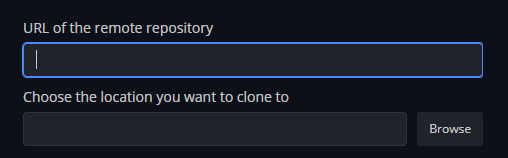

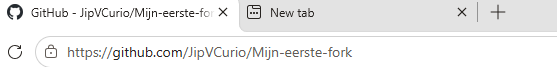

**2. De locatie om naartoe te clonen** — de (lege!) folder op je laptop waar de code terecht moet komen. Gebruik de *browse*-knop om een folder te kiezen.

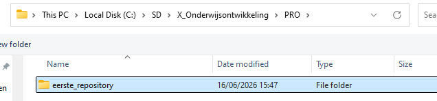

<x-callout>

**Tip:** geef de folder een duidelijke naam als `eerste_repository` en zet hem op de juiste plaats in je mappenstructuur uit week 1.

</x-callout>

Druk daarna op de **clone**-knop. Je hebt nu de online code naar je laptop gekopieerd.

## 2.10 Controleren of het clonen gelukt is

Open op je laptop de folder die je als clone-locatie koos. Daarin zou een `index.html`-bestand moeten staan. Dubbelklik erop om het te openen. Als alles goed ging, zie je nu deze website:

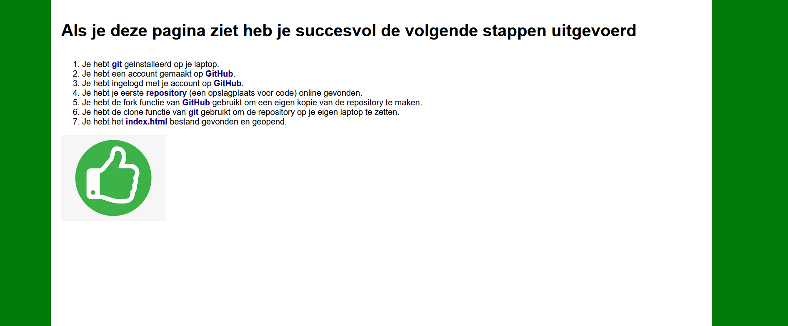

## 2.11 Volgende week

Je hebt deze week verschillende Git-technieken gebruikt om een kopie van een online repository op je eigen laptop te zetten. Volgende week leer je hoe je **zelf** code op een repository zet.

<x-nav label="Klaar met de theorie?">
[Oefeningen](/pages/week2-oefeningen.html)
[Meetmoment](/pages/week2-meetmoment.html)
[Inleveropdracht](/pages/week2-inleveropdracht.html)
</x-nav>
