## Waar gaat deze week over?

Vorige week leerde je hoe je code uit een online repository naar je laptop kopieert (*clonen*). Deze week draai je het om: je maakt **zelf** een repository, schrijft eigen code en zet die online.

<x-callout>

**Aan het einde van deze week** weet je hoe je een eigen repository maakt, wat een commit is, en hoe je je code met een push naar GitHub stuurt. Ook kun je je commitgeschiedenis terugkijken.

</x-callout>

## 3.1 Je eigen (lege) repository maken

1. Ga naar [github.com](https://github.com/), log in en ga naar **Repositories**.

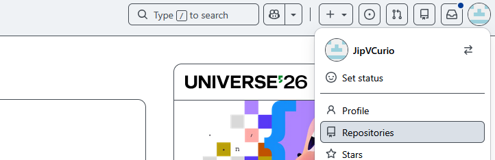

2. Klik op **New**.

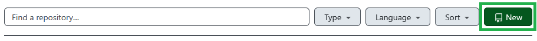

3. Vul de volgende gegevens in:
   - **Naam:** `muziekbibliotheek`
   - **Visibility:** *private* (bij *public* kan iedereen erbij — dat willen we nu niet)
   - **Geen** README
   - **Geen** .gitignore (dat behandelen we later)
   - **Geen** licentie
4. Klik op **Create repository**.

## 3.2 Controleren of het maken gelukt is

Als alles goed ging, zie je nu een 'lege' repository:

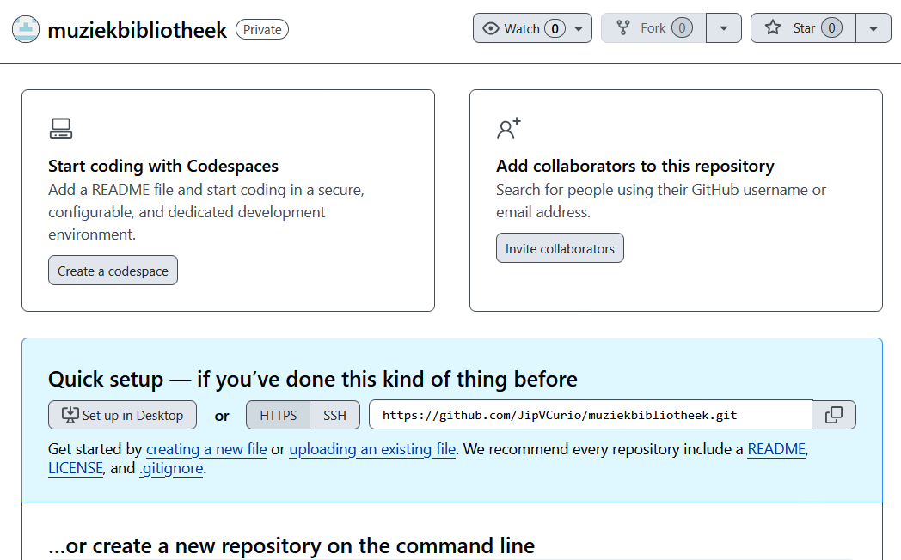

## 3.3 Je repository clonen naar je laptop

Voordat je code kunt toevoegen, moet je de repository eerst **clonen** naar je laptop. Gebruik daarvoor de tool die je vorige week koos (GitHub Desktop, GitKraken of iets anders).

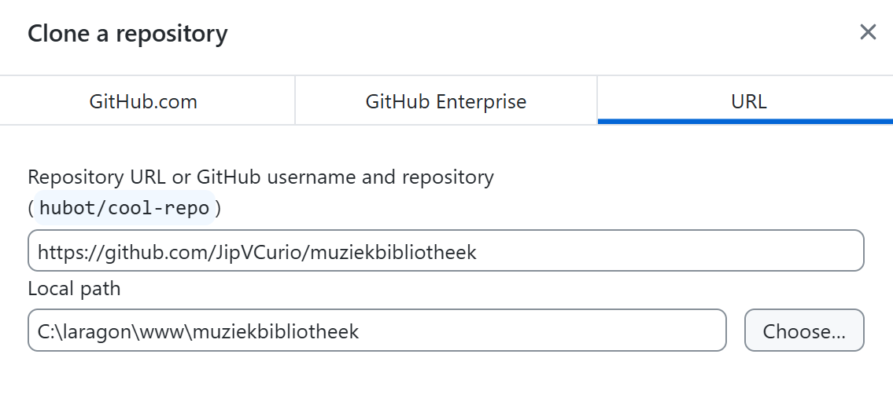

<x-callout type="warning">

Jij hebt een **andere** repository-URL en local path dan in het voorbeeld. Controleer of de local path verwijst naar de plek waar jij je code wilt opslaan.

</x-callout>

## 3.4 Controleren of het clonen gelukt is

Navigeer in je File Explorer naar de folder waar je naartoe cloonde. Controleer of er een folder `muziekbibliotheek` is.

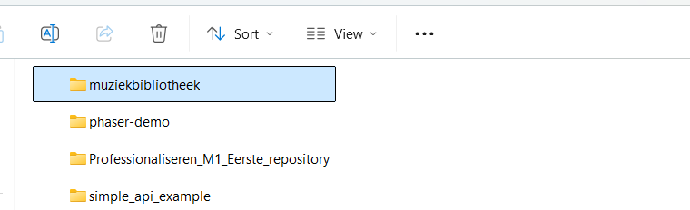

Open de folder en **zet verborgen bestanden aan** (als dat nog niet aanstaat).

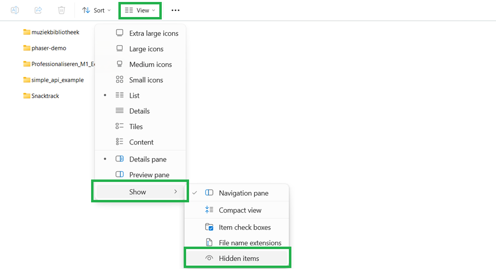

Als het clonen goed ging, zie je nu een verborgen folder met de naam **`.git`**.

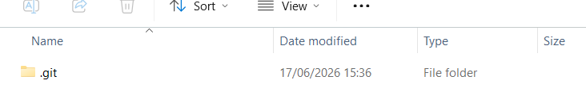

<x-callout type="warning">

De `.git`-folder bevat informatie over je repository. **Zonder deze folder werkt Git niet.** Verwijder hem niet en pas de bestanden erin niet aan.

</x-callout>

## 3.5 De muziekbibliotheek maken

Gebruik de vaardigheden die je tijdens de webles hebt geleerd om een eenvoudige website na te maken. Vervang `{jouw naam}` en `{titel}` door je eigen naam en 3 muzieknummers waar je graag naar luistert (of de eerste 3 die in je opkomen).

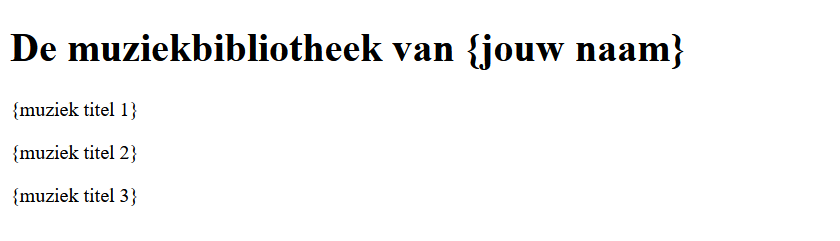

Sla het bestand op in je `muziekbibliotheek`-folder.

## 3.6 Je eerste commit maken

Voordat je je code naar de repository kunt sturen, maak je eerst een **commit**. Een commit is een moment waarop je de code opslaat zoals die op dat moment is.

Het is belangrijk dat je in de **titel** van je commit beschrijft wat je gedaan hebt. Zo weten je toekomstige teamgenoten welke aanpassingen jij hebt gemaakt.

<x-compare>
<x-compare-item title="Commit maken met GitKraken">

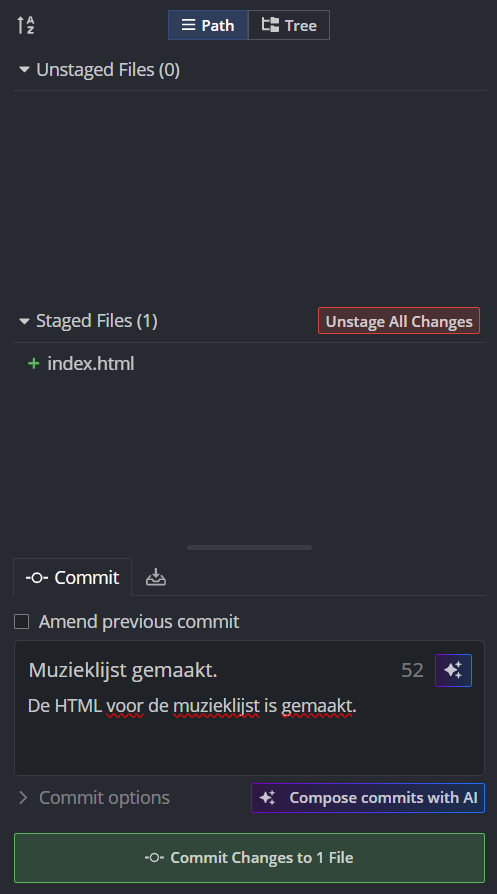

</x-compare-item>
<x-compare-item title="Commit maken met GitHub Desktop">

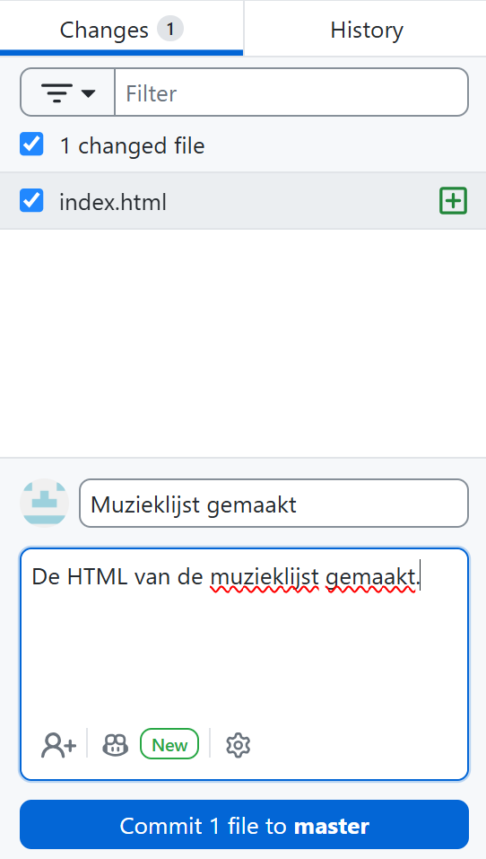

</x-compare-item>
</x-compare>

## 3.7 Je commit pushen naar de repository

Een commit wordt eerst opgeslagen op je **eigen laptop**. Om de commit (en de code erin) naar je online repository te sturen, gebruik je een **push**.

<x-compare>
<x-compare-item title="Push met GitKraken">

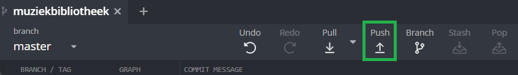

</x-compare-item>
<x-compare-item title="Push met GitHub Desktop">

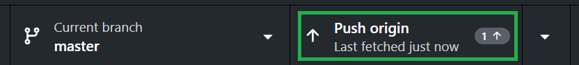

</x-compare-item>
</x-compare>

## 3.8 Controleren of je commit verstuurd is

Ga op [github.com](https://github.com/) naar de repository die je in stap 3.1 maakte. Als je push gelukt is, zie je nu je code online staan:

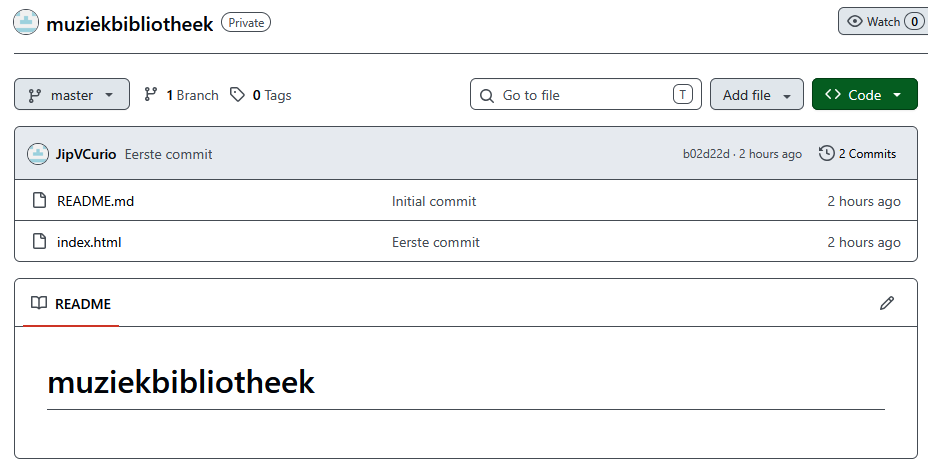

Je code staat nu op GitHub! Daardoor kun je op elke laptop verder werken — en kunnen jij en een klasgenoot later samen aan dezelfde code werken.

<x-callout type="warning">

Zie je je code nog niet op GitHub? Vraag je docent om hulp. Het is voor de rest van je opleiding belangrijk dat GitHub goed werkt.

</x-callout>

## 3.9 De regels van goede commits

Je weet nu hoe je code op een GitHub-repository zet. Onthoud de belangrijkste regel:

<x-card title="Goede commits">

- Geef elke commit een **logische, beschrijvende titel** van wat je hebt veranderd (bijvoorbeeld *"artiesten toegevoegd"*).
- Commit op **logische momenten**: telkens als je iets afgerond hebt.
- Vergeet na het committen niet te **pushen**, anders staat je code nog niet online.

</x-card>

## 3.10 Nog een wijziging: artiesten toevoegen

Oefen het commit-en-push-proces nog een keer door voor elk nummer ook de **artiest** toe te voegen. Maak daarna een nieuwe commit met een logische titel (bijvoorbeeld *"artiesten toegevoegd"*) en push deze naar je repository.

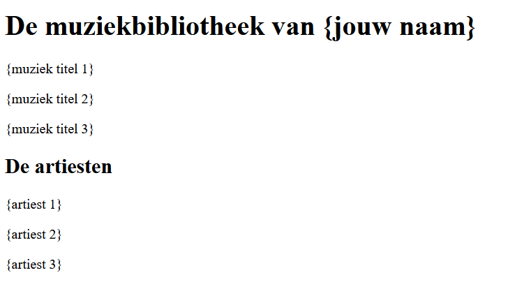

## 3.11 Je commitgeschiedenis controleren

Een voordeel van Git is dat je precies kunt zien wanneer welke code is gepusht. Klik in je GitHub-repository op **commits**.

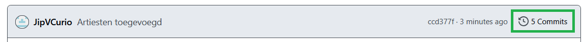

Je ziet nu de geschiedenis van je commits.

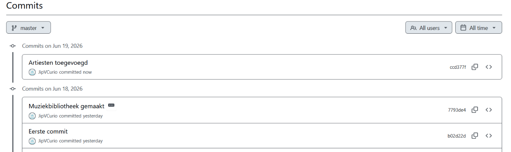

Klik op je laatste commit. Een **groene** box geeft aan dat code is toegevoegd; een **rode** box dat code is weggehaald.

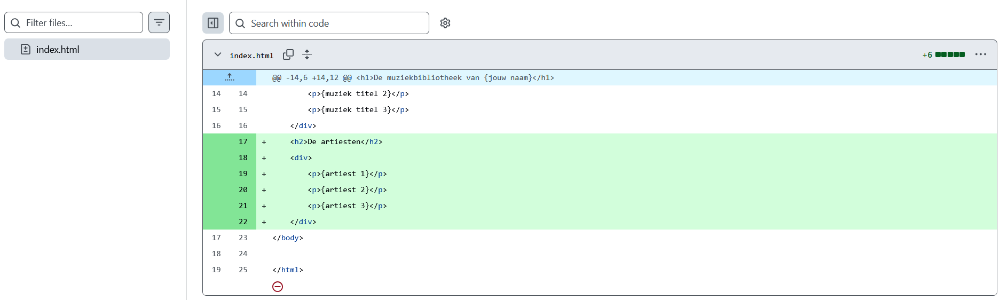

## 3.12 Volgende stappen

Vandaag heb je voor het eerst eigen code naar GitHub gestuurd. Die code is nu altijd voor je beschikbaar en je kunt terugkijken welke aanpassingen wanneer zijn gemaakt. In een volgende module leer je hoe je Git gebruikt om écht samen te werken met klasgenoten in dezelfde repository.

<x-nav label="Klaar met de theorie?">
[Oefeningen](/pages/week3-oefeningen.html)
[Meetmoment](/pages/week3-meetmoment.html)
[Inleveropdracht](/pages/week3-inleveropdracht.html)
</x-nav>
